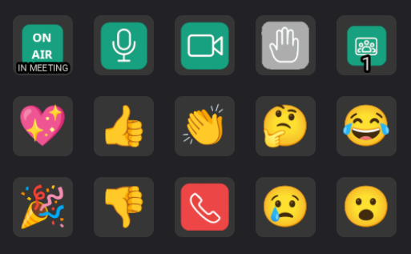

# Google Meet Controller Plugin for StreamController

Control Google Meet from your Stream Deck and see the Google Meet status in real time!



## Features

- **Toggle Microphone** - Mute/unmute with visual feedback
- **Toggle Camera** - Turn camera on/off with state display
- **Raise/Lower Hand** - Raise your hand in meetings
- **Send Reactions** - Send emoji reactions (💖 👍 🎉 👏 😂 😮 😢 🤔 👎)
- **Meeting Status** - Display showing whether you're currently in a meeting (read-only)
- **Participant Count** - Real-time participant count display (read-only)
- **Leave Call** - Leave the current meeting with a single button press

## Installation

1. Clone this plugin into your StreamController plugins directory:
   ```bash
   cd ~/.local/share/StreamController/plugins/
   git clone https://github.com/Wattos/streamcontroller-google-meets-plugin.git
   ```

2. Install the Chrome extension (see `chrome-extension/` directory)

3. Restart StreamController

## Architecture

### Backend (`backend/`)
- **auth/**: Authentication and pairing management
  - **CryptoManager**: JWS signing/verification with ES256 keys
  - **PairingManager**: Instance-based pairing approval and storage with rich metadata

- **GoogleMeetsController**: WebSocket server that communicates with Chrome extension
  - Runs on `127.0.0.1:8765` (configurable)
  - Handles handshake and JWS ES256 authentication
  - Manages instance approval and public key storage
  - Provides real-time state updates

- **Backend**: Wrapper that exposes clean API to StreamController actions
  - `toggle_microphone()`, `toggle_camera()`, `toggle_hand()`
  - `send_reaction(reaction)`
  - `leave_call()` - leave the current meeting
  - `get_state()` - returns current mic/camera/hand/meeting state
  - `get_mic_enabled()`, `get_camera_enabled()`, `get_hand_raised()`
  - `get_in_meeting()` - check if currently in a meeting
  - `get_participant_count()` - get number of participants
  - `approve_instance()`, `deny_instance()`, `revoke_instance()`

### Actions (`actions/`)
- **ToggleMic**: Toggle microphone with ON/OFF state display
- **ToggleCamera**: Toggle camera with ON/OFF state display
- **RaiseHand**: Raise/lower hand with RAISED state display
- **SendReaction**: Send reactions with configurable reaction selection
- **InMeetingStatus**: Read-only display showing meeting status (IN MEETING / NOT IN MEETING)
- **ParticipantCount**: Read-only display showing real-time participant count
- **LeaveCall**: Leave the current meeting with visual feedback

All actions extend `GoogleMeetActionBase` and use the mixin pattern for reusable behavior.

## Chrome Extension

The Chrome extension provides secure communication between Google Meet and StreamController:

### Features
- **Modular Architecture**: Feature-based organization (microphone, camera, hand-raising, reactions, meeting-info)
- **StreamControllerClient**: Clean abstraction for WebSocket communication
- **ES256 Key Pair**: Generated in browser using Web Crypto API
- **Instance-Based Pairing**: Each browser instance (profile) gets unique identity
- **Rich Metadata**: Pairing requests include browser name, version, OS info

### Pairing Flow

1. Extension generates ES256 key pair on first run
2. Connects to WebSocket server at `ws://127.0.0.1:8765`
3. Sends handshake with extension ID, instance ID, public key, and metadata
4. User approves instance in StreamController (sees browser, OS, user info)
5. All subsequent messages signed with JWS using private key
6. Server verifies signatures using stored public key

### Message Protocol

#### Handshake (Pairing)
```json
{
  "type": "handshake",
  "extension_id": "chrome_extension_id",
  "instance_id": "uuid-v4",
  "public_key": {
    "kty": "EC",
    "crv": "P-256",
    "x": "...",
    "y": "..."
  },
  "metadata": {
    "extension_name": "Google Meet StreamController Bridge",
    "extension_version": "1.0.0",
    "browser_name": "Chrome",
    "browser_version": "120.0",
    "os": "Linux",
    "timestamp": 1234567890
  }
}
```

Server responds after approval:
```json
{
  "type": "handshake_success",
  "message": "Pairing approved"
}
```

#### Authenticated Messages
All non-handshake messages include JWS token:
```json
{
  "type": "state|heartbeat",
  "extension_id": "...",
  "instance_id": "...",
  "data": {
    "mic_enabled": true,
    "camera_enabled": false,
    "hand_raised": false,
    "in_meeting": true,
    "participant_count": 5
  },
  "token": "eyJhbGciOiJFUzI1NiIsInR5cCI6IkpXVCJ9..."
}
```

The token payload contains:
```json
{
  "type": "state",
  "instance_id": "...",
  "data": { ... },
  "iat": 1234567890,
  "exp": 1234568190
}
```

## Security

- **Localhost only**: WebSocket server binds to 127.0.0.1
- **Instance approval**: Each browser instance must be approved in plugin settings
- **JWS ES256 authentication**: All messages signed with asymmetric cryptography
  - Extension generates ES256 key pair in browser
  - Public key shared during pairing
  - Private key never leaves browser
  - Messages signed with JWS compact serialization
  - Server verifies using stored public key
- **Instance isolation**: Each browser instance (profile) has unique identity
- **Rich metadata**: Pairing requests include browser, OS, and user info for context

## Configuration

Actions can be configured with:
- WebSocket port (default: 8765)
- Reaction selection (for SendReaction action)

## Development

### Project Structure
```
.
├── actions/              # StreamController action implementations
├── backend/              # WebSocket server and authentication
├── chrome_extension/     # Browser extension for Google Meet integration
├── assets/               # Icons and images
├── docs/                 # Documentation and screenshots
├── main.py               # Plugin registration
├── manifest.json         # Plugin metadata
└── README.md
```

## Release Process

This project uses automated CI/CD for releases. When a version bump is merged to main, the following happens automatically:

### Automated Release Workflow

1. **Build**: Chrome extension is built with Vite
2. **Package**: Both Chrome extension and StreamController plugin are packaged as .zip files
3. **Publish to Chrome Web Store**: Extension is automatically uploaded and published
4. **Create GitHub Release**: Release is created with both packages attached

### Creating a Release

```bash
# Navigate to chrome_extension directory
cd chrome_extension

# Bump version (choose one)
# This updates BOTH Chrome extension AND StreamController plugin versions
npm run version:patch   # 1.0.0 → 1.0.1
npm run version:minor   # 1.0.0 → 1.1.0
npm run version:major   # 1.0.0 → 2.0.0

# Commit and push
git add .
git commit -m "chore: bump version to v1.0.1"
git push origin your-branch

# Create and merge PR
# GitHub Actions will automatically handle the release
```

### Manual Release (Local Testing)

```bash
cd chrome_extension

# Build and package everything
npm run release

# Output files:
# - google-meet-streamcontroller-extension-{version}.zip
# - google-meet-streamcontroller-plugin-{version}.zip
```

### Required GitHub Secrets

For automated publishing, add these secrets to your GitHub repository:

- `CHROME_EXTENSION_ID` - Your Chrome Web Store extension ID
- `CHROME_CLIENT_ID` - OAuth2 client ID
- `CHROME_CLIENT_SECRET` - OAuth2 client secret
- `CHROME_REFRESH_TOKEN` - OAuth2 refresh token

See `scripts/setup-chrome-credentials.md` for detailed setup instructions.

## License

MIT License - See LICENSE file
